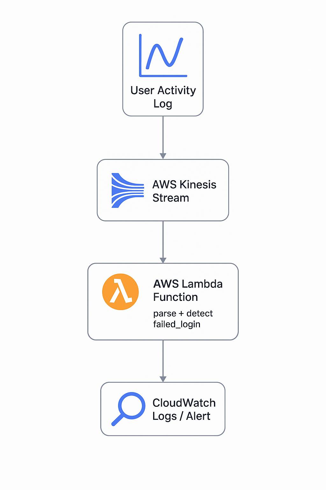

# 🧠 Event Analytics Pipeline

A real-time event processing system using AWS Kinesis and AWS Lambda, designed to detect potential login attacks and anomalous user behaviors.

---

## 🔍 Project Overview

This project sets up an event-driven architecture where user activity logs are streamed via AWS Kinesis and processed in near real-time using AWS Lambda. When a `failed_login` event is detected, the system flags it as a potential security threat.

---

## 📂 Project Structure
## 🧭 Architecture Diagram

